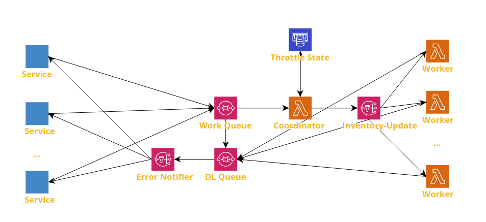

# Shopify Inventory Manager

A simple proof of concept microservice for handling Shopify inventory management.

## Design

### The Happy Path

If fully implemented, the way this microservice would work is:

- A service sends a request to the Work Queue containing an inventory update
- The Coordinator dequeues messages and hold and release them at a rate that prevents exceeding the API limit, using elasticache to store throttle state
- The messages are released to the lambdas who hit the shopify API

### Error Handling

A dead letter queue in SQS connected to an Error Notifier in SNS take care of notifying services of errors.

- If the coordinator fails, the work queue will send error state to the DLQ
- If the lambdas fail they will send their error state to the dead letter queue

This service explicitly does not handle its own errors, beyond a set number of retry attempts. Should a job fail repeatedly, the services are notified and it is up to them if they wish to keep trying or revert to their initial state and alert a client or another service.

### Data Structures

#### Message Operations

Messages must be of a type defined in the `Operations` interface, and contain a `data` key.

### Throttle State

API limits typically take the form of: "Limited to `m` requests every `n` [seconds/minutes/etc.]".

Throttle state contains just two values:

- `timerStart`: Timestamp, with milliseconds
- `sentQty`: Quantity of messages sent since `timerStart`

The way the throttle works is:

- The Coordinator dequeues a message
- If the current time is `n` seconds/etc. greater than `timerStart`:
  - Set `timerStart` to the current time
  - Clear `sentQty` and set to 0
  - Send message to worker
- If the current time is **not** `n` seconds/etc greater than `timerStart`:
  - If `sentQty < m`:
    - Increment `sentQty`
    - Send message to worker
  - If `sentQty >= m`:
    - Hold the message until the current time is `n` seconds/etc. greater than `timerStart`
    - Set `timerStart` to the current time
    - Clear `sentQty` and set to 0
    - Send message to worker

## Throttling Design Comparisons

### Pros and Cons of Current Design

**Pros**:

- Maintains good order, with Coordinator sitting at the mouth of the queue
- Throttling can be configured to work exactly within API limits
- Behaviour is identical during bursty and calm periods
- Never waits longer than the API limit time length (minus one millisecond) to send a message

**Cons**:

- Adds latency to requests
- Adds some complexity to error handling, workers must send errors to the dead letter queue themselves

new prob with mine: Different ops take different amounts of time. Could still end up clustered

## An Alternative Design: Distributed Locks in Elasticache

This design functions by and large the same as the first, except that there is no coordinator. When a lambda dequeues a message, it will check the Throttle State. If it needs to update it, it will acquire a lock on it, write to it, then release the lock.

**Pros**:

- Lower latency as the message goes directly from the queue to the worker
- Throttling can be configured to work exactly within API limits

**Cons**:

- During bursty traffic FIFO order will be lost, as all sleeping workers wake up to try to write Throttle State at once
  - It is nondeterministic which worker will end up gaining the lock
- It is hypothetically possible for a worker to time out, although waiting 15 minutes is extremely unlikely
- Added complexity in ensuring the correctness of the distributed lock

## What is Incomplete

The microservice is not done. The following components are missing or not functioning properly.

### The Deadletter Queue

When errors are thrown, the error metadata is not be added by SQS or Lambda, such as the error name, staktrace, etc.

Message are ending up in the dead letter queue inconsistently, and very slowly.

### Not implemented:

- SNS Error Notifier
- Coordinator
- Throttle State
- KMS to hide API secrets
